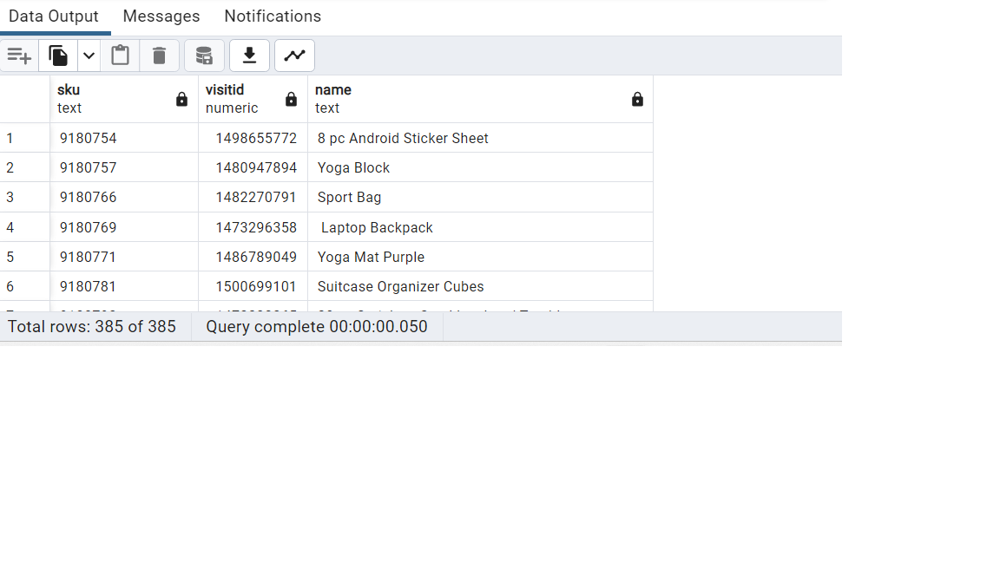
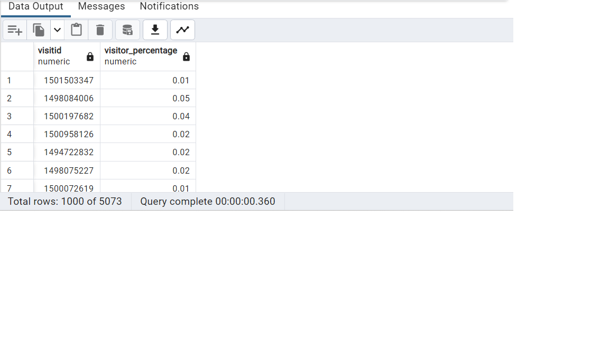

Question 1: find all duplicate records

SQL Queries:  

    SELECT * FROM all_sessions

    SELECT DISTINCT * FROM all_sessions
    WHERE fullvisitorid IN (SELECT fullvisitorid FROM (
    SELECT fullvisitorid, COUNT(*)
                FROM all_sessions
                GROUP BY fullvisitorid
                HAVING COUNT(*) > 1) AS COUNT);

---ALTERNATIVE WAY----

    SELECT DISTINCT * FROM analytics WHERE visitnumber IN  (
    SELECT visitnumber FROM (
      SELECT visitnumber, 
      ROW_NUMBER() OVER
      (PARTITION BY visitnumber ORDER BY visitnumber asc) AS Row
      FROM analytics
    ) AS duplicate_data
    WHERE
    duplicate_data.Row > 1);

Answer: 1705 row in all_sessions
      1697078 row in analytics

Question 2: find the total number of unique visitors (`fullVisitorID`)

SQL Queries:    
    
    SELECT DISTINCT COUNT(fullvisitorid)
                    FROM all_sessions

Answer:     13429 rows

Question 3: find the total number of unique visitors by referring sites

SQL Queries:  

    SELECT COUNT(DISTINCT visitid)
    FROM analytics
    WHERE channelGrouping = 'Referral'

    SELECT COUNT(DISTINCT visitid)
    FROM all_sessions
    WHERE channelGrouping = 'Referral'

Answer:  FROM analytics table 28631
        FROM ALL_SESSION TABLE 2251

Question 4: find each unique product viewed by each visitor

SQL Queries:    

        SELECT DISTINCT ON (p.sku) p.sku,
        s.visitid,
        p.name
        FROM products p
        JOIN all_sessions s
        ON p.sku = s.productsku
        ORDER BY p.sku

Answer: 

Question 5: compute the percentage of visitors to the site that actually makes a purchase
    

SQL Queries: 

    SELECT DISTINCT a.visitid,
    ROUND(COUNT(a.timeonsite) / SUM(COUNT(r.total_ordered)) OVER () * 100,2) AS visitor_percentage
    FROM analytics AS a
    JOIN all_sessions AS s
    ON a.fullvisitorid = s.fullvisitorid
    JOIN products AS p
    ON s.productsku =p.sku
    JOIN sales_by_sku AS r
    ON p.sku = r.productsku
    GROUP BY a.visitid

Answer: 

