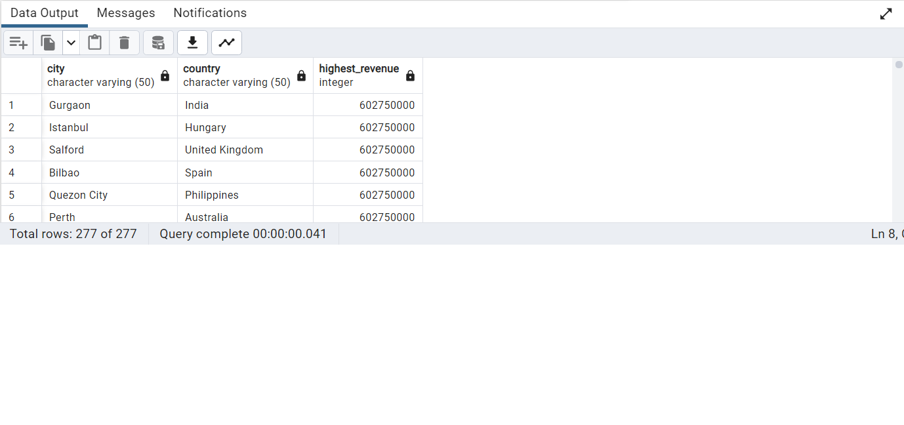
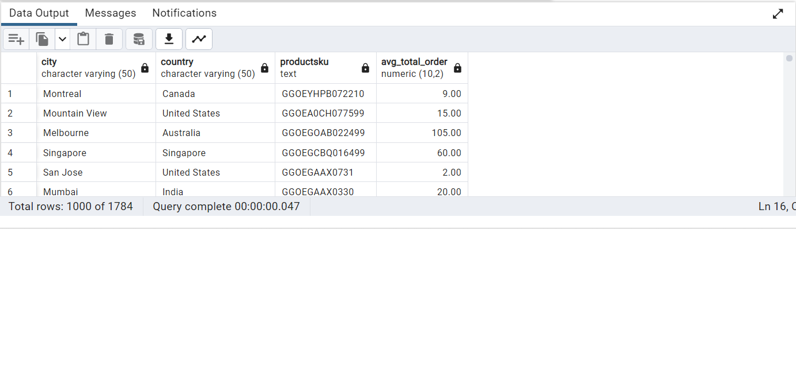
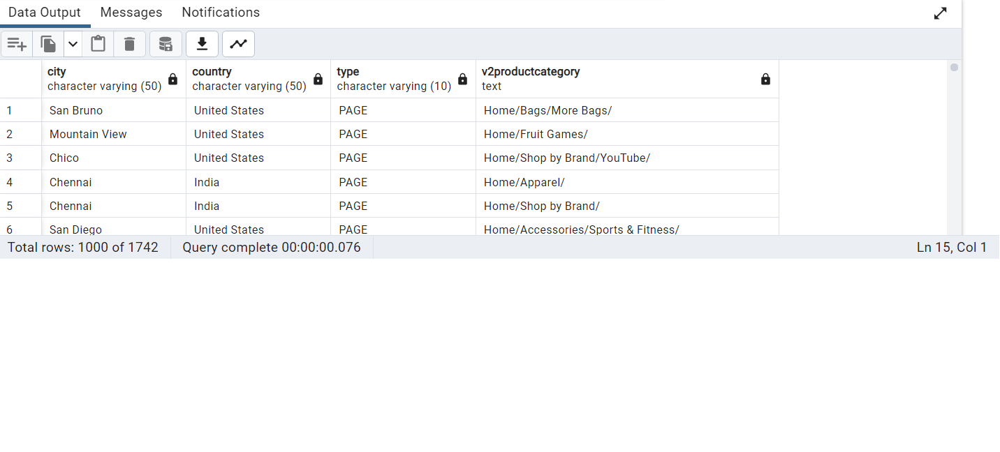
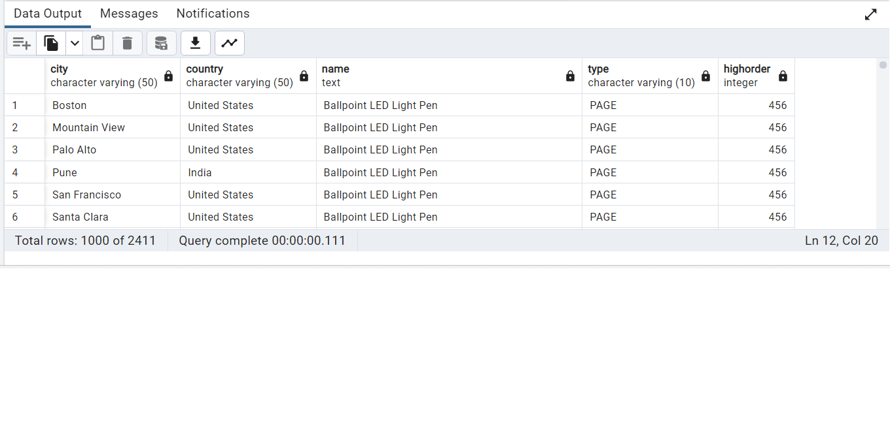
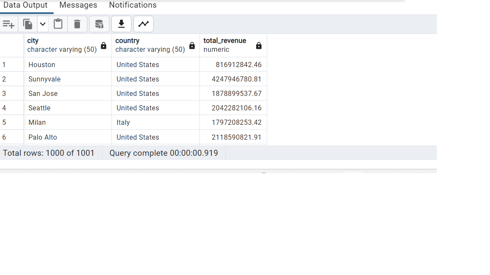

Answer the following questions and provide the SQL queries used to find the answer.

    
**Question 1: Which cities and countries have the highest level of transaction revenues on the site?**

SQL Queries:    

		SELECT DISTINCT city,
						country,
		MAX(transactionrevenue) AS highest_revenue
		FROM   all_sessions
		WHERE city <> 'not available in demo dataset'
		AND city <> '(not set)'
		GROUP BY city,country

Answer:  

**Question 2: What is the average number of products ordered from visitors in each city and country?**

SQL Queries:   

		 SELECT DISTINCT 
			s.city,
		    s.country,
			s.productsku,
            AVG (total_ordered) :: NUMERIC(10,2)AS 		Avg_Total_order
         FROM sales_by_sku AS sales
		INNER JOIN all_sessions AS s
		ON sales.productsku = s.productsku
		WHERE city <> 'not available in demo dataset'
        AND country <> 'not available in demo dataset'
		AND city <> '(not set)'
		AND country <> '(not set)'
		AND total_ordered <> '0'
	    GROUP BY sales.productsku,s.city,
				s.country,s.visitid,s.productsku

Alternative way for result use view table :

		CREATE OR REPLACE VIEW avg_total_order AS
		SELECT DISTINCT s.city,
		        s.country,
				s.productsku,
                 AVG (total_ordered) :: NUMERIC(10,2) AS Avg_Total_order
        FROM sales_by_sku AS sales
		INNER JOIN all_sessions AS s
		ON sales.productsku = s.productsku
		WHERE city <> 'not available in demo dataset'
    	 AND country <> 'not available in demo dataset'
		AND city <> '(not set)'
		AND country <> '(not set)'
		AND total_ordered <> '0'
	    GROUP BY sales.productsku,s.city,
		s.country,s.visitid,s.productsku

		SELECT * FROM avg_total_order;

Answer: 

**Question 3: Is there any pattern in the types (product categories) of products ordered from visitors in each city and country?**

SQL Queries: 	

	SELECT DISTINCT s.city,
	     s.country,
		 s.type,
		 s.v2productcategory
    FROM all_sessions AS s
    LEFT JOIN analytics AS a
    ON a.fullvisitorid = s.fullvisitorid                                  
    LEFT JOIN sales_report AS r
    ON s.productsku = r.productsku
	WHERE s.country <> '(not set)' 
	AND s.city <> '(not set)'
    AND s.city <>'not available in demo dataset'
	AND s.country <> 'not available in demo dataset'
	AND s.v2productcategory <> '(not set)'

USE CTE :: Improve the readability of complex query 

	WITH product_info AS (
	SELECT DISTINCT s.city,
			s.country,
			s.type,
			s.v2productcategory
	FROM all_sessions AS s
	LEFT JOIN analytics AS a
	ON a.fullvisitorid = s.fullvisitorid                                  
	LEFT JOIN sales_report AS r
		ON s.productsku = r.productsku

	)
	SELECT *
	FROM product_info
	WHERE country <> '(not set)' 
	AND city <> '(not set)'
	AND city <>'not available in demo dataset'
	AND country <> 'not available in demo dataset'
	AND v2productcategory <> '(not set)'

Answer: 

**Question 4: What is the top-selling product from each city/country? Can we find any pattern worthy of noting in the products sold?**

SQL Queries:	

	SELECT  DISTINCT s.city,
				s.country,
				r.name,
				type,
				MAX(total_ordered) as highorder
	FROM all_sessions AS s
    JOIN sales_report AS r
	ON s.productsku = r.productsku
	WHERE city <> 'not available in demo dataset'
    AND country <> 'not available in demo dataset'
	AND city <> '(not set)'
	AND country <> '(not set)'
    GROUP BY r.name,s.city,s.country,s.type
    ORDER BY highorder DESC
	
USE CTE :: Improve the readability of complex query 
	
	WITH top_selling_products AS(
	SELECT  DISTINCT s.city,
				s.country,
				r.name,
				type,
				MAX(total_ordered) as highorder
	FROM all_sessions AS s
    JOIN sales_report AS r
	ON s.productsku = r.productsku
	GROUP BY r.name,s.city,s.country,s.type
    ORDER BY highorder DESC
	
	)
	SELECT * 
	FROM top_selling_products
	WHERE city <> 'not available in demo dataset'
	AND country <> 'not available in demo dataset'
	AND city <> '(not set)'
	AND country <> '(not set)'
    
Answer: 

**Question 5: Can we summarize the impact of revenue generated from each city/country?**

SQL Queries:	

		SELECT DISTINCT s.city,
				s.country,
				ROUND(SUM(a.revenue),2) AS Total_Revenue
		FROM all_sessions AS s
		JOIN analytics AS a
		ON s.fullvisitorid = a.fullvisitorid
		WHERE country != '(not set)'
        AND city != '(not set)'
        AND city !='not available in demo dataset'
		AND country !='not available in demo dataset'
		GROUP BY a.fullvisitorid,s.city,s.country
		
USE CTE :: Improve the readability of complex query 

	WITH generate_revenue AS (
	SELECT DISTINCT s.city,
					s.country,
					ROUND(SUM(a.revenue),2) AS Total_Revenue
			FROM all_sessions AS s
			JOIN analytics AS a
			ON s.fullvisitorid = a.fullvisitorid
			GROUP BY a.fullvisitorid,s.city,s.country
	)
	SELECT *
	FROM generate_revenue
	WHERE country != '(not set)'
	AND city != '(not set)'
	AND city !='not available in demo dataset'
	AND country !='not available in demo dataset'

Answer:	

